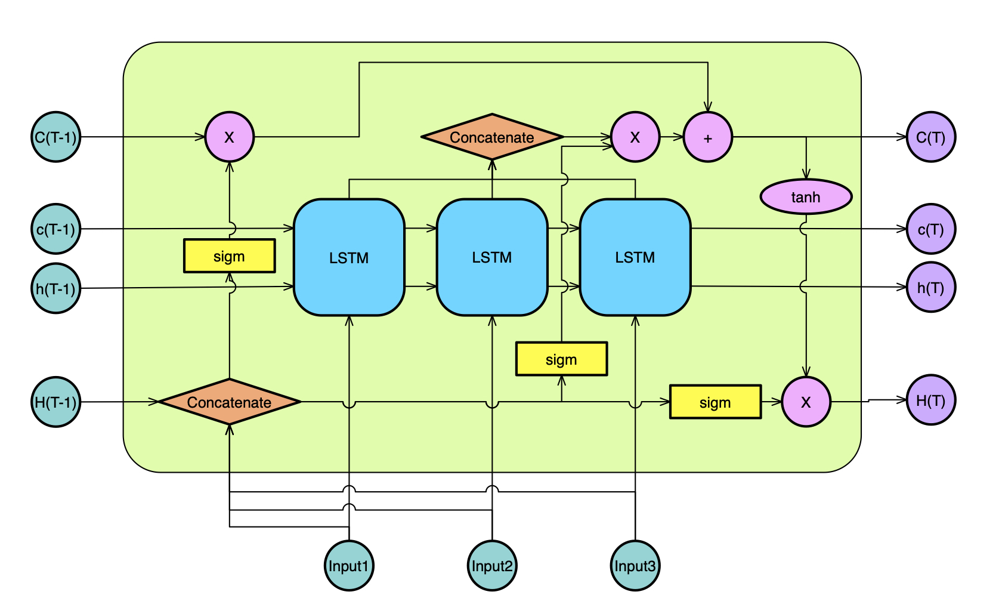

# JujubeCakeCell

## Introduction

This is a nested LSTM RNN cell, named JujubeCakeCell. It has a structure as shown in this figure

In the process of JujubeCakeCell, it has a chain of LSTM cells and it collects the state vectors of a given number of LSTM cells to compose its own state vector for itself. As for other aspects, JujubeCakeCell has a similar structure like LSTM cell.

Here, we present an implemetation based on Tensorflow and Keras. To use JujubeCakeCell as a recurrent layer, we recommend you to use JujubeCake directly. You can run `python debug.py` to have a try.

In `debug.py`, there is an example that we use Reuters dataset to make a classifier using JujubeCakeCell.

Note: when you use JujubeCake as a layer, you should use `JujubeCake()` to instant an RNN layer and you should always perform Reshape layer before JujubeCake.

## Dependencies

Tensorflow 1.14

## Update Log

* 29 March 2020 
   * Add config and from_config for Jujubecake.
   * Support masking now.
   * To implement masking in Jujubecake, `module.MaskReshape` is needed.
   * In `debug.py` there is a comparison experiment based on reaters datasets in function `test_on_reaters`.
   * Change the dependencies in 1.14. It hasn't been tested on tf1.15 or tf2.x.
